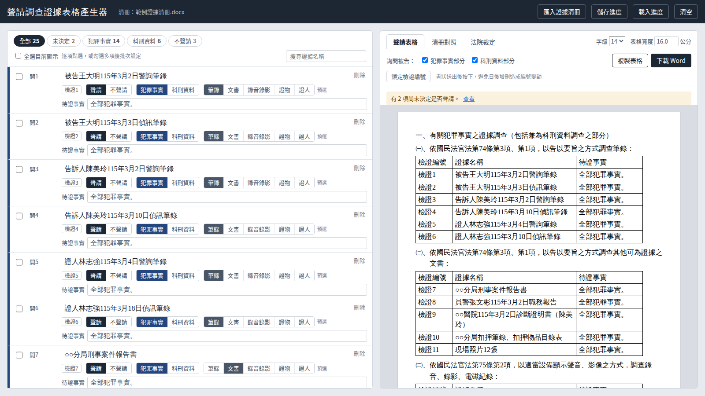

# 聲請調查證據表格產生器

上傳證據清冊（Word 或 PDF），逐項點選是否聲請、犯罪事實或科刑資料、調查方法，自動產生國民法官案件準備程序書中「聲請調查證據」的表格。另可製作證據清冊對照表、記錄法院裁定結果。



## 使用方式

1. 下載 [`dist/聲請調查證據表格產生器.html`](dist/)。
2. 以 Edge 或 Chrome 開啟（不支援 IE）。
3. 把證據清冊拖進畫面左側，開始點選。

程式為單一 HTML 檔，完全離線執行，不需安裝；匯入的檔案只在本機處理，不會上傳。可先用 [`examples/範例證據清冊.docx`](examples/) 試用。

## 主要功能

- 讀取 Word（.docx）清冊中的表格，或可選取文字的 PDF 清冊
- 依名稱預選調查方法（筆錄、文書、錄音錄影、證物、證人），可逐項或批次更正
- 依國民法官法規定的順序自動排列、連續編列檢證編號
- 下載 Word 檔，或複製表格貼到 Word／漢書
- 書狀送出後鎖定檢證編號，補充聲請時接續編號
- 證據清冊對照表、法院裁定對照表（准許／僅准作科刑資料／保留／駁回）
- 儲存與載入工作進度

## 檔案說明

| 路徑 | 內容 |
| --- | --- |
| `dist/` | 可直接使用的程式（單一 HTML 檔） |
| `src/` | 原始碼：`index.html`（版面）、`app.js`（功能）、`app.css`（樣式） |
| `build.py` | 把原始碼與函式庫合併成 `dist/` 裡的單一檔案 |
| `examples/` | 虛構的範例證據清冊 |
| `third_party_licenses/` | 內含函式庫的授權條款 |

## 修改程式後重新產生

需先安裝 [Node.js](https://nodejs.org/) 與 [Python](https://www.python.org/)：

```
npm install
python build.py
```

## 使用的開源函式庫

- [JSZip](https://github.com/Stuk/jszip) 3.10.1（MIT 授權）：讀寫 Word 檔
- [PDF.js](https://github.com/mozilla/pdf.js) 3.11.174（Apache License 2.0）：讀取 PDF 文字

授權條款全文見 `third_party_licenses/`。

## 注意

本儲存庫不含任何真實案件資料。請勿將證據清冊、書狀、進度檔（`.json`）或輸出的 Word 檔上傳至此。
